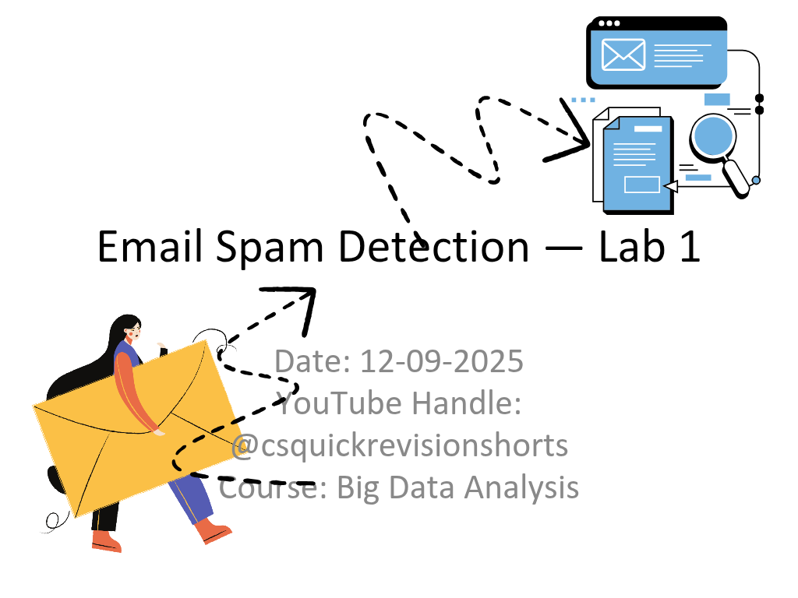

# Email Spam Detection Hands-on

**Brief:**  
Python-based Email Spam Detection Hands-on: Model (TF-IDF + Naive Bayes) training, prediction, error analysis, and PowerPoint presentation summarizing the experiment and results.

## Repository Contents
- `spam_main.py` — Main script: trains model, evaluates metrics, and generates PowerPoint.  
- `spam_prediction.py` — Script for predicting new emails and error analysis.  
- `samples.csv` — Sample dataset of emails with labels (Spam/Ham). Optional if sample data is included in the scripts.

## Requirements
- Python 3.8+  
- Packages: `scikit-learn`, `matplotlib`, `python-pptx`  

## How to Run
1. Open Colab or a local Python environment.  
2. Upload the scripts.  
3. Run `spam_main.py` first → generates model results and PowerPoint.  
4. Run `spam_prediction.py` → predicts new samples and performs error analysis.  

## License / Usage
- This repository is for **viewing and academic reference only**.  
- You may **share** the code freely; citation is encouraged.  
- Citation format: [Repository URL] [accessed date].  
- **Modification requires explicit permission from the author.**
- Attribution to the original author is required.  
- The author is **not responsible** for any issues arising from use of the code.

## Notes
- `samples.csv` is optional; sample data is included in the program body.  
- Confusion matrix images and PPT slides are auto-generated.  
- For reproducibility, keep `random_state` in `train_test_split` consistent.  
- The material is also available at: https://www.youtube.com/@csquickrevisionshorts
